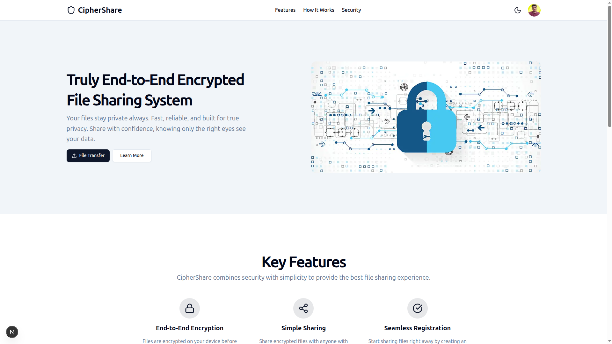
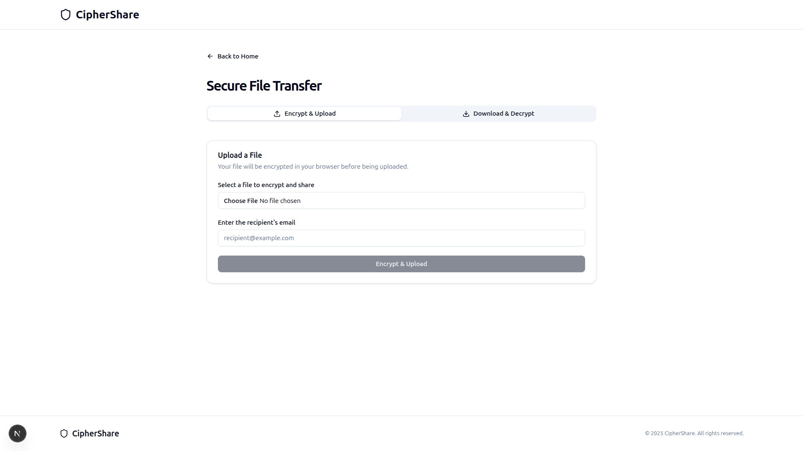
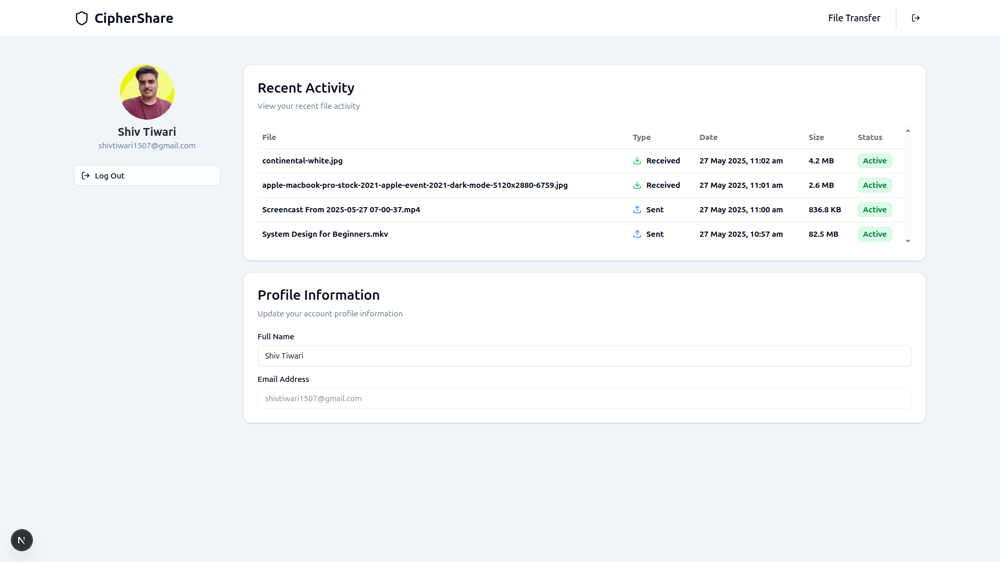

# 🔐 CipherShare

A **Secure File Sharing Platform with End-to-End Encryption**, built to ensure **privacy-first file exchange** using public key cryptography. CipherShare encrypts files on the sender's side using the receiver's public key — ensuring that only the intended recipient can decrypt them with their private key.

---

## 🚀 Features

- 🔐 End-to-End Encryption (E2EE) using asymmetric cryptography
- 🗂️ Secure File Upload and Download
- 🔑 Public Key Management
- 🧾 Automatic file deletion after 24 hours
- ☁️ AWS S3 for file storage and AWS EC2 for Deployment

---

## 📷 Screenshots








## ⚙️ Tech Stack

- **Frontend**: Next.js, TypeScript, TailwindCSS, ShadCN UI
- **Backend**: Next.js
- **Database**: PostgreSQL
- **Auth**: NextAuth with credentials provider and google provider (with some custom logic)
- **Encryption**: Web Crypto API
- **Storage**: AWS S3
- **Deployment**: AWS EC2 + Nginx + PM2

---

## 🧠 How It Works

1. **User Signs Up**  
   - Generates a public/private key pair.  
   - Then they are prompted for a passphrase.
   - The private key gets encrypted using the passphrase (passphrase-derived AES key).
   - Both the keys are then stored in the database.

2. **File Sending**  
   - Sender encrypts the file using an AES key and that key is then encrypted using the receiver's public key.  
   - Encrypted file data is uploaded to AWS S3.

3. **File Receiving**  
   - Receiver downloads the encrypted file.
   - Receiver is prompted for the passphrase again, this time to decrypt the private key.
   - Decryption happens on the client using this private key.

✅ **The server never has access to the decrypted contents.**

---

## 🛠️ Getting Started

### 1. Clone the Repository

```bash
git clone https://github.com/shivdotsol/cipher-share.git
cd cipher-share
npm install
```

### 2. Configure Environment Variables
```bash
DATABASE_URL="your_postgres_url"
NEXTAUTH_SECRET="some_secret"
NEXTAUTH_URL="http://localhost:3000"
AUTH_GOOGLE_ID="your_google_auth_id.apps.googleusercontent.com"
AUTH_GOOGLE_SECRET="your_google_secret"
REDIS_URL="redis-url.redis-cloud.com:14163"
REDIS_PASSWORD="your-redis-password"
RESEND_API_KEY="re_resend-api-key"
S3_ACCESS_KEY_ID="aws-user-access-key-id"
S3_SECRET_ACCESS_KEY="aws-user-secret"
```

### 3. Run the development server
```bash
npm run dev
```

### 🤝 Contributions are welcome